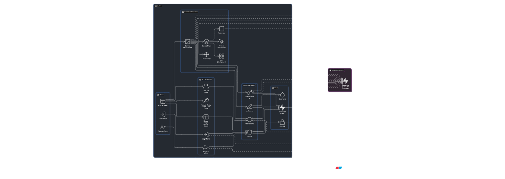

# CollabCanvas MVP ✅

**🎉 MVP SUCCESSFULLY DELIVERED!**

A real-time collaborative canvas application where multiple users can create and manipulate rectangles simultaneously on a shared canvas, with live cursor tracking and presence awareness.

## 🎯 Project Overview

CollabCanvas is a completed MVP for a collaborative design tool that enables multiple users to work together in real-time on a shared canvas. Users can create, move, resize, and delete rectangles while seeing each other's cursors and presence.

**Status:** ✅ **COMPLETE** - All MVP requirements met and performance targets achieved.

## 🏗️ Architecture



The application uses a dual-channel real-time architecture with direct database operations for ownership management.

## ✨ Features

- **Real-time Collaboration** - Multiple users editing simultaneously
- **Live Cursors** - See where other users are working with names and colors
- **Presence Awareness** - Modal showing online users with avatars
- **Object Ownership** - Prevents editing conflicts with atomic claim/release system
- **Smooth Performance** - 60 FPS maintained during all interactions
- **User Authentication** - Secure login with display names
- **State Persistence** - Canvas state saved across sessions
- **Color Picker** - Full color selection for rectangles
- **Multi-select** - Select and manipulate multiple objects
- **Keyboard Shortcuts** - Delete, duplicate, and navigation shortcuts

## 🛠️ Tech Stack

- **Frontend:** Next.js 15 (App Router), TailwindCSS, shadcn/ui
- **Canvas:** react-konva (React wrapper for Konva.js)
- **Backend:** Supabase (Auth + Realtime + Database)
- **State Management:** React hooks (no external state library)
- **Runtime:** Bun
- **Deployment:** Vercel

## 🚀 Getting Started

### Prerequisites

- [Bun](https://bun.sh/) installed
- [Supabase CLI](https://supabase.com/docs/guides/cli) installed

### Installation

1. **Clone the repository**
   ```bash
   git clone <repository-url>
   cd collab-canvas
   ```

2. **Install dependencies**
   ```bash
   bun install
   ```

3. **Set up Supabase**
   ```bash
   bunx supabase start
   bunx supabase db reset
   ```

4. **Configure environment variables**
   Create `.env.local` with your Supabase credentials:
   ```bash
   NEXT_PUBLIC_SUPABASE_URL=your_supabase_url
   NEXT_PUBLIC_SUPABASE_ANON_KEY=your_supabase_anon_key
   SUPABASE_SERVICE_ROLE_KEY=your_service_role_key
   ```

5. **Start the development server**
   ```bash
   bun dev
   ```

6. **Open your browser**
   Navigate to [http://localhost:3000](http://localhost:3000)

## 🎮 How to Use

1. **Register/Login** - Create an account or sign in
2. **Create Rectangles** - Click and drag on the canvas
3. **Move Objects** - Click and drag rectangles to move them
4. **Resize Objects** - Use the corner handles to resize
5. **Multi-select** - Hold Shift and click multiple objects
6. **Delete Objects** - Select objects and press Delete key
7. **Duplicate Objects** - Select objects and press Ctrl+D
8. **Change Colors** - Use the color picker in the toolbar
9. **View Online Users** - Click the connection status indicator

## 🧪 Testing Real-time Features

1. **Open multiple browser windows/tabs** to the canvas page
2. **Login with different accounts** (or same account in different tabs)
3. **Create rectangles** in one window and see them appear in others
4. **Move objects** and watch real-time synchronization
5. **See live cursors** of other users as they work
6. **Test ownership conflicts** - try to edit objects owned by others

For detailed testing instructions, see [REALTIME_TEST_GUIDE.md](./REALTIME_TEST_GUIDE.md).

## 📁 Project Structure

```
collab-canvas/
├── app/                    # Next.js App Router
│   ├── (auth)/            # Authentication routes
│   ├── canvas/            # Main canvas page
│   └── layout.tsx         # Root layout
├── components/            # React components
│   ├── canvas/            # Canvas-specific components
│   ├── layout/            # Layout components
│   ├── auth/              # Authentication components
│   └── ui/                # shadcn/ui components
├── hooks/                 # Custom React hooks
├── lib/                   # Utility libraries
│   └── supabase/          # Supabase client configuration
├── types/                 # TypeScript type definitions
├── supabase/              # Database schema and migrations
└── memory-bank/           # Project documentation
```

## 🔧 Development Commands

```bash
# Start development server
bun dev

# Start Supabase locally
bunx supabase start

# Reset database
bunx supabase db reset

# Stop Supabase
bunx supabase stop

# Build for production
bun run build

# Start production server
bun start
```

## 📊 Performance Targets ✅

- **✅ 60 FPS** - Maintained during all interactions
- **✅ <100ms** - Object sync latency across users
- **✅ <50ms** - Cursor position sync latency
- **✅ Multiple objects** - Smooth performance with many objects
- **✅ Multiple users** - Smooth collaboration with concurrent users

## 🚀 Deployment

The application is deployed on Vercel and publicly accessible. For deployment instructions, see the [Vercel deployment documentation](https://nextjs.org/docs/app/building-your-application/deploying).

## 📚 Documentation

- [Product Requirements Document](./PRD.md) - Detailed project specifications
- [Real-time Testing Guide](./REALTIME_TEST_GUIDE.md) - How to test collaboration features
- [Performance Testing](./PERFORMANCE_TEST.md) - Performance benchmarks and testing
- [Memory Bank](./memory-bank/) - Project documentation and context
- [Tasks](./tasks.md) - Development progress and completed features

## 🎯 Success Criteria ✅

### MVP Requirements - ALL COMPLETE
- ✅ Canvas with pan/zoom
- ✅ Rectangle creation & movement
- ✅ Real-time 2+ user sync
- ✅ Multiplayer cursors with labels
- ✅ Online presence list (modal)
- ✅ Auth with display names
- ✅ Public deployment
- ✅ Ownership system prevents conflicts
- ✅ State persists

### Performance Goals - ALL ACHIEVED
- ✅ 60 FPS under load
- ✅ <100ms object sync
- ✅ <50ms cursor sync
- ✅ Handles multiple objects smoothly
- ✅ Supports multiple concurrent users smoothly

## 🏗️ Architecture Highlights

- **Dual Channel System** - Broadcast channels for CRUD operations + database subscriptions for ownership
- **Optimistic UI** - Immediate feedback with server validation
- **Automatic Reconnection** - Handles network disconnections gracefully
- **Creator Ownership** - Objects are owned by their creators initially
- **Atomic Ownership Claims** - Database-level validation prevents conflicts

### Ownership Conflict Management

The ownership system prevents editing conflicts through an atomic claim/release mechanism:

1. **Pending Claim** - When a user clicks an object, they make a pending claim (yellow border)
2. **Server Validation** - Database validates the claim atomically (only if `owner === "all"`)
3. **Success** - User can move the object, which shows their color border
4. **Rejection** - If another user claimed it first, shows red border with owner's name
5. **Locked State** - Other users cannot select the object until the owner releases it
6. **Release** - Owner releases by clicking empty space or finishing their edit

This ensures only one user can edit an object at a time while providing clear visual feedback about ownership status.

## 🤝 Contributing

This MVP is complete and successful. Future enhancements could include:
- Additional shape tools (circles, text)
- Advanced transformations (rotation)
- Undo/redo functionality
- Mobile responsive design
- Performance optimizations for very large canvases

## 📄 License

This project is part of a development challenge demonstrating AI-assisted development with comprehensive documentation and clean architecture.

---

**The CollabCanvas MVP has been successfully delivered with all requirements met and performance targets achieved.**